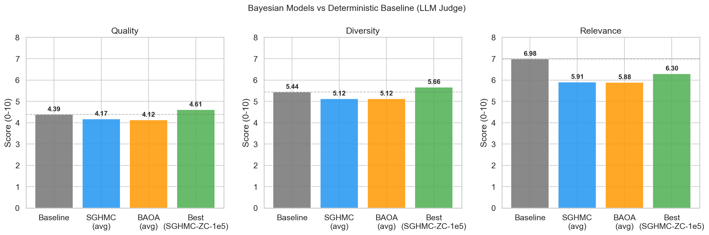
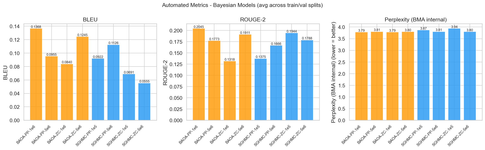

# Bayesian SGMCMC Evaluation Report

## Setup

### Model Architecture
- **Base model**: NanoGPT (10.65M params, 6 layers, 6 heads, 384 embed dim, block size 256, vocab 65)
- **Task**: Character-level Shakespeare text generation
- **Baseline**: Deterministic pretrained NanoGPT (AdamW, 2000 steps)

### Experimental Design
- **Models**: 8 Bayesian models in a 2x2x2 design + 1 deterministic baseline
  - **Samplers**: SGHMC, BAOA
  - **Priors**: Pretrained-centered, Zero-centered
  - **Learning rates**: Lower (BAOA 1e-6 / SGHMC 5e-6), Higher (BAOA 5e-6 / SGHMC 1e-5)

### Training Hyperparameters (shared)
- Warmup: 200 steps, Sampling: 1000 steps, Thinning: every 10th sample
- Batch size: 16, Sequence length: 128, Training samples: 10,000

| Parameter | BAOA | SGHMC |
|-----------|------|-------|
| Friction/alpha | 0.01 | 0.1 |
| Noise sigma | 1.0 | 1.0 |
| Beta | - | 0.0 |
| Prior std | 0.1 (lr=1e-6) / 1.0 (lr=5e-6) | 1.0 (all) |

> **Note**: BAOA configs at lr=1e-6 use prior_std=0.1 while all other configs use prior_std=1.0. This is a confound with the learning rate comparison.

### Evaluation Setup
- **LLM Judge**: Qwen2.5-7B-Instruct scoring quality, diversity, relevance (0-10)
  - Generation grid: temperature [0.3, 0.8] x top-k [10, 50] x num BMA samples [10, 30]
  - Max new tokens: 600, 4 Shakespeare prompts per config
- **Automated metrics**: BLEU, ROUGE, internal perplexity via BMA
  - 4 text samples, prompt length 30 chars, generation length 30 chars
  - Perplexity: batch size 16, max 4 batches, seq length min(block_size, 256)

## LLM Judge Results

| Model | Sampler | Prior | LR | Quality | Diversity | Relevance | Avg |
|-------|---------|-------|----|---------|-----------|-----------|-----|
| Baseline | Baseline | N/A | N/A | 4.39 | 5.44 | 6.98 | 5.60 |
| SGHMC-ZC-1e5 | SGHMC | zero-centered | 1e-05 | 4.61 | 5.66 | 6.30 | 5.52 |
| BAOA-PP-1e6 | BAOA | pretrained | 1e-06 | 4.33 | 5.27 | 6.25 | 5.28 |
| SGHMC-PP-1e5 | SGHMC | pretrained | 1e-05 | 4.05 | 5.11 | 6.20 | 5.12 |
| BAOA-PP-5e6 | BAOA | pretrained | 5e-06 | 4.14 | 5.19 | 5.83 | 5.05 |
| BAOA-ZC-1e6 | BAOA | zero-centered | 1e-06 | 4.12 | 4.95 | 5.83 | 4.97 |
| BAOA-ZC-5e6 | BAOA | zero-centered | 5e-06 | 3.91 | 5.05 | 5.61 | 4.86 |
| SGHMC-ZC-5e6 | SGHMC | zero-centered | 5e-06 | 3.83 | 4.89 | 5.81 | 4.84 |
| SGHMC-PP-5e6 | SGHMC | pretrained | 5e-06 | 4.19 | 4.81 | 5.33 | 4.78 |

### Comparison with Baseline

The deterministic baseline (pretrained NanoGPT without Bayesian sampling) serves as the reference point.

> **Note**: The baseline was evaluated with varied generation configs (temperature 0.3/0.8, top-k 10/20, multiple sample counts), while Bayesian models used a fixed generation config. Both use the same Qwen2.5-7B-Instruct judge.

| | Quality | Diversity | Relevance | Avg |
|---|---------|-----------|-----------|-----|
| **Baseline** | 4.39 | 5.44 | 6.98 | 5.60 |
| **Bayesian avg** | 4.15 | 5.12 | 5.90 | 5.05 |
| **Best (SGHMC-ZC-1e5)** | 4.61 | 5.66 | 6.30 | 5.52 |

| Metric | Bayesian avg vs Baseline | Best vs Baseline |
|--------|------------------------|------------------|
| Quality | -5.5% | +5.0% |
| Diversity | -6.0% | +4.0% |
| Relevance | -15.5% | -9.7% |

### SGHMC vs BAOA

| Metric | SGHMC | BAOA | Winner |
|--------|-------|------|--------|
| Quality | 4.17 | 4.12 | **SGHMC** |
| Diversity | 5.12 | 5.12 | **Tie** |
| Relevance | 5.91 | 5.88 | **SGHMC** |

### Pretrained vs Zero-Centered Prior

| Metric | Pretrained | Zero-Centered | Winner |
|--------|------------|---------------|--------|
| Quality | 4.18 | 4.12 | **Pretrained** |
| Diversity | 5.09 | 5.14 | **Zero-Centered** |
| Relevance | 5.90 | 5.89 | **Pretrained** |

### Learning Rate Effect

Each sampler was tested at two learning rates. The LR effect differs by sampler:
- **SGHMC**: Higher LR (1e-5) is better than lower (5e-6) across all metrics
- **BAOA**: Lower LR (1e-6) is better than higher (5e-6) across all metrics

| Sampler | Lower LR avg | Higher LR avg | Better LR |
|---------|-------------|---------------|-----------|
| SGHMC | 4.81 | 5.32 | **Higher** |
| BAOA | 5.12 | 4.96 | **Lower** |

### Sampler x Prior Interaction

## Automated Metrics

BLEU, ROUGE-2, and internal perplexity were computed via BMA (Bayesian Model Averaging) over posterior samples, evaluated on random windows from train and val splits (averaged below).

| Model | BLEU | ROUGE-2 | Perplexity |
|-------|------|---------|------------|
| BAOA-PP-1e6 | 0.1368 | 0.2045 | 3.79 |
| BAOA-PP-5e6 | 0.0955 | 0.1773 | 3.81 |
| BAOA-ZC-1e6 | 0.0840 | 0.1318 | 3.79 |
| BAOA-ZC-5e6 | 0.1245 | 0.1911 | 3.80 |
| SGHMC-PP-1e5 | 0.0922 | 0.1375 | 3.87 |
| SGHMC-PP-5e6 | 0.1126 | 0.1666 | 3.81 |
| SGHMC-ZC-1e5 | 0.0691 | 0.1944 | 3.94 |
| SGHMC-ZC-5e6 | 0.0555 | 0.1788 | 3.80 |

### Automated Metrics: Sampler Comparison

| Metric | SGHMC | BAOA | Winner |
|--------|-------|------|--------|
| BLEU | 0.0823 | 0.1102 | **BAOA** |
| ROUGE-2 | 0.1693 | 0.1762 | **BAOA** |
| Perplexity | 3.86 | 3.80 | **BAOA** |

### Automated Metrics: Prior Comparison

| Metric | Pretrained | Zero-Centered | Winner |
|--------|------------|---------------|--------|
| BLEU | 0.1093 | 0.0833 | **Pretrained** |
| ROUGE-2 | 0.1715 | 0.1740 | **Zero-Centered** |
| Perplexity | 3.82 | 3.83 | **Pretrained** |

**Interpretation**: Perplexity values are tightly clustered (range 3.79 - 3.94), indicating all Bayesian models achieve similar language modeling quality. BLEU and ROUGE-2 show more variation but low absolute values, reflecting the inherent difficulty of char-level generation matching exact n-grams. The LLM judge captures qualitative differences (style, coherence, relevance) that automated metrics miss.

### Automated Metrics: Baseline Comparison

> **Not directly comparable**: The baseline and Bayesian models were evaluated with different pipelines. The baseline uses standard (non-BMA) generation and GPT-2 external perplexity, while the Bayesian models use BMA generation and internal perplexity. Both were evaluated across multiple configurations. Differences in absolute values primarily reflect the evaluation pipeline, not model quality.

| Metric | Baseline (avg over 8 configs) | Bayesian avg | Notes |
|--------|-------------------------------|--------------|-------|
| BLEU | 0.2581 | 0.0963 | Different generation method and length |
| ROUGE-2 | 0.5228 | 0.1728 | Different prompt/generation setup |
| Perplexity | 125.6 | 3.83 | GPT-2 external vs BMA internal — incomparable |

## Key Findings

1. **Baseline comparison**: The best Bayesian model (SGHMC-ZC-1e5, avg 5.52) scores -1.4% vs baseline (avg 5.60) on LLM judge. On average, Bayesian models score -9.8% vs baseline, with lower quality/diversity/relevance but the gap is small.
2. **Best model**: SGHMC-ZC-1e5 (avg 5.52/10)
3. **Learning rate is the largest factor** (effect size 0.341), but it interacts with sampler choice:
   - SGHMC prefers higher LR (1e-5 >> 5e-6, +0.51 avg)
   - BAOA prefers lower LR (1e-6 >> 5e-6, +0.17 avg)
4. **SGHMC vs BAOA**: Nearly identical on average (5.07 vs 5.04). Sampler choice alone has minimal impact (effect 0.026).
5. **Prior type**: Pretrained and zero-centered priors perform similarly (5.06 vs 5.05). Smallest effect (0.011).
6. **Automated metrics are near-uniform**: Perplexity varies by <5% across all 8 models, suggesting all converge to similar language modeling quality. The LLM judge is more discriminative for generation quality.
7. **Practical implication**: The optimal LR depends on the sampler. Each sampler has a preferred operating regime rather than one LR being universally better.

---
*Generated from `notebooks/analysis_report.ipynb`*
