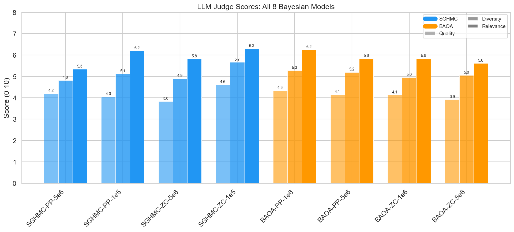
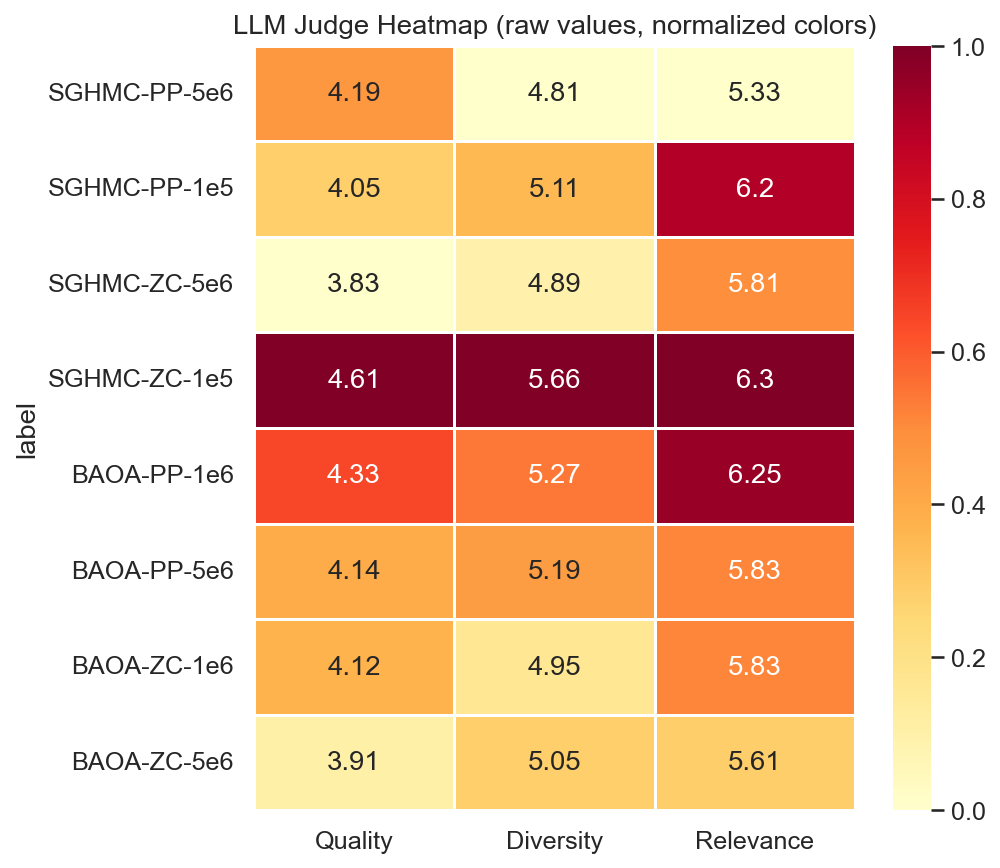
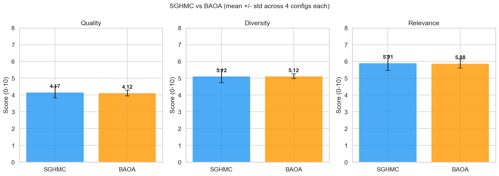
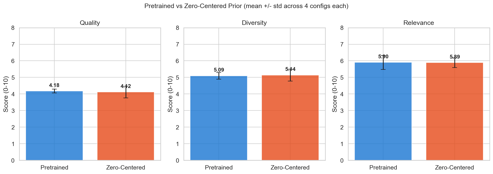
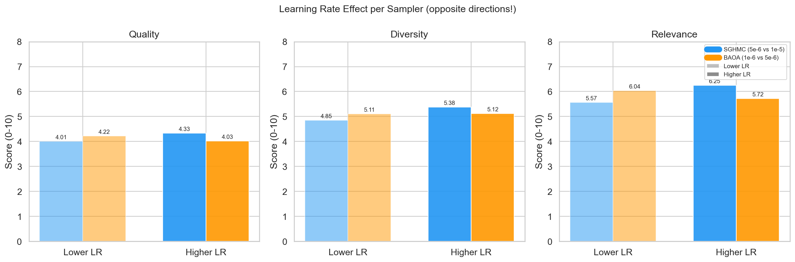
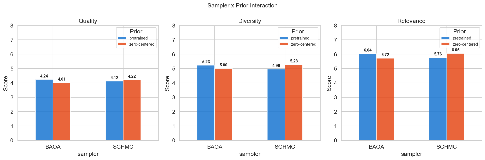

# Bayesian SGMCMC Evaluation Report

## Setup

- **Models**: 8 Bayesian models in a 2x2x2 design
  - **Samplers**: SGHMC, BAOA
  - **Priors**: Pretrained-centered, Zero-centered
  - **Learning rates**: Lower (BAOA 1e-6 / SGHMC 5e-6), Higher (BAOA 5e-6 / SGHMC 1e-5)
- **Architecture**: NanoGPT (10.65M params, 6 layers, 6 heads, 384 embed, char-level Shakespeare)
- **LLM Judge**: Qwen2.5-7B-Instruct scoring quality, diversity, relevance (0-10)
- **Automated**: BLEU, ROUGE, internal perplexity via BMA over posterior samples

## LLM Judge Results

| Model | Sampler | Prior | LR | Quality | Diversity | Relevance | Avg |
|-------|---------|-------|----|---------|-----------|-----------|-----|
| SGHMC-ZC-1e5 | SGHMC | zero-centered | 1e-05 | 4.61 | 5.66 | 6.30 | 5.52 |
| BAOA-PP-1e6 | BAOA | pretrained | 1e-06 | 4.33 | 5.27 | 6.25 | 5.28 |
| SGHMC-PP-1e5 | SGHMC | pretrained | 1e-05 | 4.05 | 5.11 | 6.20 | 5.12 |
| BAOA-PP-5e6 | BAOA | pretrained | 5e-06 | 4.14 | 5.19 | 5.83 | 5.05 |
| BAOA-ZC-1e6 | BAOA | zero-centered | 1e-06 | 4.12 | 4.95 | 5.83 | 4.97 |
| BAOA-ZC-5e6 | BAOA | zero-centered | 5e-06 | 3.91 | 5.05 | 5.61 | 4.86 |
| SGHMC-ZC-5e6 | SGHMC | zero-centered | 5e-06 | 3.83 | 4.89 | 5.81 | 4.84 |
| SGHMC-PP-5e6 | SGHMC | pretrained | 5e-06 | 4.19 | 4.81 | 5.33 | 4.78 |

### SGHMC vs BAOA

| Metric | SGHMC | BAOA | Winner |
|--------|-------|------|--------|
| Quality | 4.17 | 4.12 | **SGHMC** |
| Diversity | 5.12 | 5.12 | **Tie** |
| Relevance | 5.91 | 5.88 | **SGHMC** |

### Pretrained vs Zero-Centered Prior

| Metric | Pretrained | Zero-Centered | Winner |
|--------|------------|---------------|--------|
| Quality | 4.18 | 4.12 | **Pretrained** |
| Diversity | 5.09 | 5.14 | **Zero-Centered** |
| Relevance | 5.90 | 5.89 | **Pretrained** |

### Learning Rate Effect

Each sampler was tested at two learning rates. The LR effect differs by sampler:
- **SGHMC**: Higher LR (1e-5) is better than lower (5e-6) across all metrics
- **BAOA**: Lower LR (1e-6) is better than higher (5e-6) across all metrics

| Sampler | Lower LR avg | Higher LR avg | Better LR |
|---------|-------------|---------------|-----------|
| SGHMC | 4.81 | 5.32 | **Higher** |
| BAOA | 5.12 | 4.96 | **Lower** |

### Sampler x Prior Interaction

## Key Findings

1. **Best model**: SGHMC-ZC-1e5 (avg 5.52/10)
2. **Learning rate is the largest factor** (effect size 0.341), but it interacts with sampler choice:
   - SGHMC prefers higher LR (1e-5 >> 5e-6, +0.51 avg)
   - BAOA prefers lower LR (1e-6 >> 5e-6, +0.17 avg)
3. **SGHMC vs BAOA**: Nearly identical on average (5.07 vs 5.04). Sampler choice alone has minimal impact (effect 0.026).
4. **Prior type**: Pretrained and zero-centered priors perform similarly (5.06 vs 5.05). Smallest effect (0.011).
5. **Practical implication**: The optimal LR depends on the sampler. Each sampler has a preferred operating regime rather than one LR being universally better.

---
*Generated from `notebooks/analysis_report.ipynb`*
