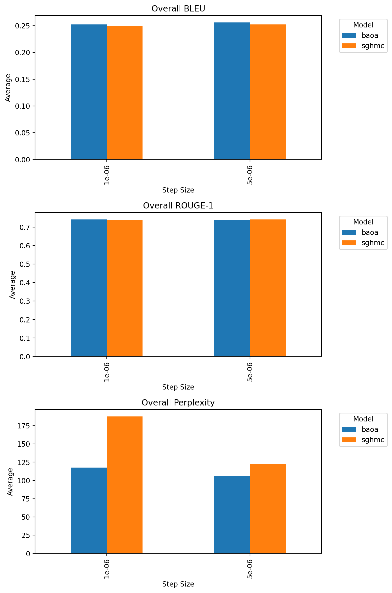
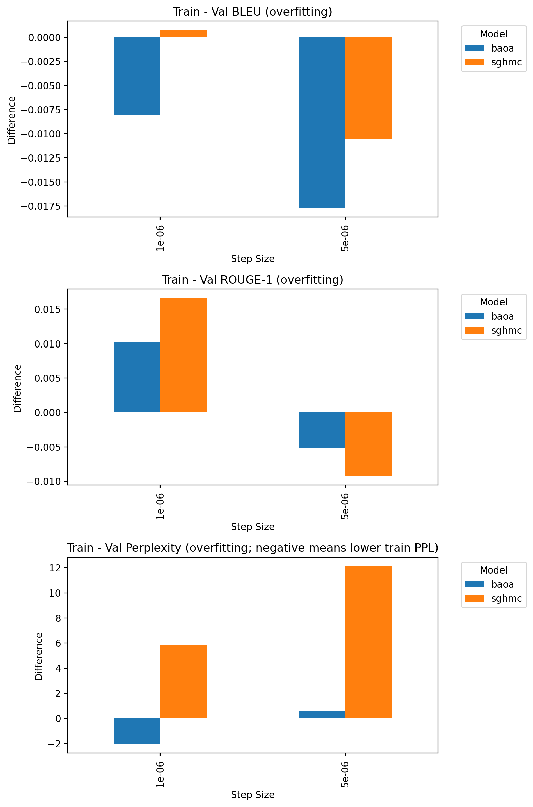

This report summarizes the effect of step size on evaluation metrics and overfitting for Bayesian samplers (excluding the deterministic baseline).

## Overall Metrics

- Observation: 5e-06 yields slightly higher BLEU and ROUGE-1, small decreases in ROUGE-2/ROUGE-L.
- Notable: Perplexity is substantially lower at 5e-06, indicating sharper predictions.

## Overfitting (Train − Val)

- BLEU/ROUGE-1 gaps: 5e-06 reduces BLEU gap (more negative) and flips ROUGE-1 to slightly negative, suggesting less overfitting on these metrics.
- Perplexity gap: Larger at 5e-06 (train−val PPL difference increases), even though overall PPL is better.

## Quick Numbers (Averages across models)

- Overall delta (5e-06 − 1e-06): BLEU +0.0035; ROUGE-1 +0.0012; ROUGE-2 −0.0040; ROUGE-L −0.0002; PPL −38.65
- Overfitting delta (5e-06 − 1e-06): BLEU −0.0105; ROUGE-1 −0.0206; PPL +4.50