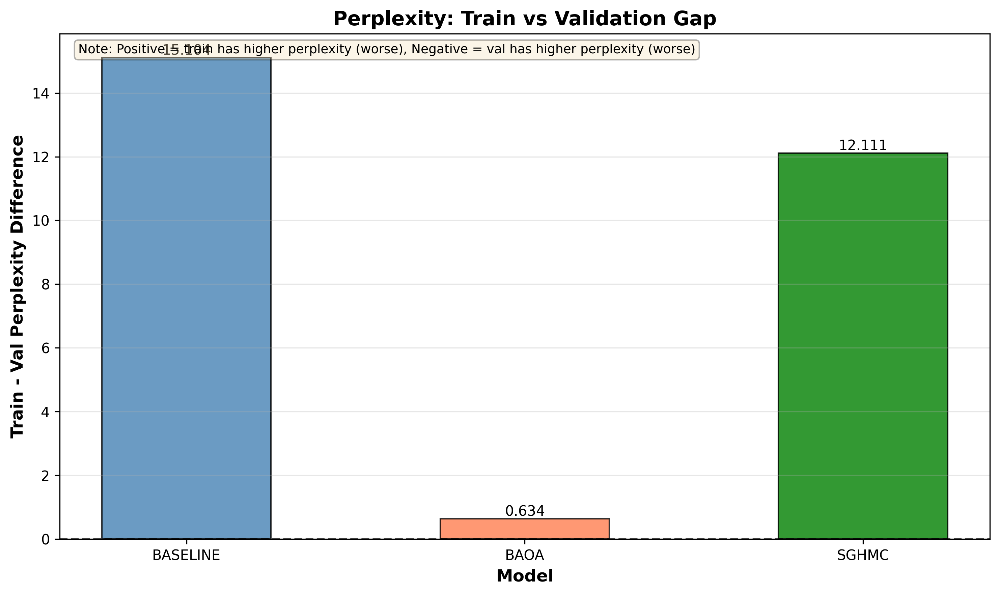

# BNN Text Generation

This report summarizes results for Bayesian samplers (BAOA, SGHMC) and a baseline model, using both automatic metrics (BLEU/ROUGE/perplexity) and an LLM-judge rubric (Quality/Diversity/Relevance).

## Contents

- [1) Step size experiment](#1-step-size-experiment-bayesian-samplers)
- [2) Automatic metrics](#2-automatic-metrics-bleurougeperplexity)
- [3) Decoding effects (figures)](#3-decoding-effects-figures)
- [4) LLM-judge results](#4-llm-judge-evaluation-quality--diversity--relevance)
- [5) One-line takeaway](#5-one-line-takeaway)

---

## 1) Step Size Experiment (Bayesian samplers)

This section summarizes the effect of step size on evaluation metrics and overfitting for Bayesian samplers (excluding the baseline model).

### Summary — Does increasing step size help?

- Moving from 1e-06 → 5e-06:
	- BLEU: +0.0035, ROUGE‑1: +0.0012 (slight gains)
	- ROUGE‑2: −0.0040, ROUGE‑L: −0.0002 (neutral to slight dips)
	- Perplexity: −38.65 (substantial improvement; lower is better)
- Overfitting: train−val gaps shrink for BLEU/ROUGE‑1, but PPL gap grows.
- Net: 5e‑06 is generally better overall, with notably lower perplexity, while keeping similarity metrics roughly flat to slightly improved.

### Overall Metrics

- Observation: 5e-06 yields slightly higher BLEU and ROUGE-1, small decreases in ROUGE-2/ROUGE-L.
- Notable: Perplexity is substantially lower at 5e-06, indicating sharper predictions.

### Overfitting (Train − Val)

- BLEU/ROUGE-1 gaps: 5e-06 reduces BLEU gap (more negative) and flips ROUGE-1 to slightly negative, suggesting less overfitting on these metrics.
- Perplexity gap: Larger at 5e-06 (train−val PPL difference increases), even though overall PPL is better.

### Quick Numbers (Averages across models)

- Overall delta (5e-06 − 1e-06): BLEU +0.0035; ROUGE-1 +0.0012; ROUGE-2 −0.0040; ROUGE-L −0.0002; PPL −38.65
- Overfitting delta (5e-06 − 1e-06): BLEU −0.0105; ROUGE-1 −0.0206; PPL +4.50

---

## 2) Automatic Metrics (BLEU/ROUGE/Perplexity)

This section contains the aggregated automatic-metric analysis across decoding configurations (`temperature`, `top_k`, `num_samples`).

How to read:
- BLEU/ROUGE: higher is better (n-gram similarity to references).
- Perplexity (PPL): lower is better (likelihood-based).

Key takeaways:
- Model families are close on mean BLEU/ROUGE.
- Temperature has a strong effect: higher temperature improves BLEU/ROUGE2 but increases perplexity sharply.

---

### Model Evaluation Metrics Report

_Last update: 2026-01-08T03:37:10.752977_

#### 2.1 Dataset & evaluation footprint

- Configurations evaluated: **24**
- Total sample evaluations (all configurations combined): **overall=96**, **train=72**, **val=24**
- Per-configuration count appears constant: **overall=4**, **train=3**, **val=1** samples.

#### 2.2 Model-level comparison (overall split)

##### 2.2.1 Overall averages across hyperparameters (higher is better for BLEU/ROUGE; lower is better for perplexity)

| model | configs | bleu_mean | bleu_std | rouge2_mean | rouge2_std | rougeL_mean | ppl_mean | ppl_std |
| --- | --- | --- | --- | --- | --- | --- | --- | --- |
| baoa | 8 | 0.2561 | 0.0210 | 0.5146 | 0.0447 | 0.3797 | 105.7359 | 60.2734 |
| baseline | 8 | 0.2581 | 0.0190 | 0.5228 | 0.0424 | 0.3807 | 125.6453 | 85.6553 |
| sghmc | 8 | 0.2522 | 0.0146 | 0.5130 | 0.0409 | 0.3784 | 122.3775 | 74.7445 |

**Readout:** the three model families are close on average. Baseline is marginally highest on mean BLEU/ROUGE2, but variance is high.

##### 2.2.2 Best configuration per model (ranked by overall BLEU)

| model | temperature | top_k | num_samples | bleu | rouge2 | rougeL | perplexity | config_key |
| --- | --- | --- | --- | --- | --- | --- | --- | --- |
| baseline | 0.8000 | 50 | 10 | 0.2854 | 0.5810 | 0.3827 | 198.9008 | baseline_temp0.8_topk50_samples10_baseline |
| baoa | 0.8000 | 10 | 30 | 0.2793 | 0.5596 | 0.3796 | 178.9917 | baoa_temp0.8_topk10_samples30_run_20251224-145920 |
| sghmc | 0.8000 | 10 | 30 | 0.2714 | 0.5569 | 0.3757 | 206.5861 | sghmc_temp0.8_topk10_samples30_run_20251226-113201 |

#### 2.3 Hyperparameter effects (overall split)

##### 2.3.1 Temperature (0.8 vs 0.3): consistent quality uplift, large perplexity increase

Average deltas when moving from **T=0.3 → T=0.8** (overall):

| model | bleu_delta_0.8-0.3 | rouge2_delta_0.8-0.3 | rougeL_delta_0.8-0.3 | ppl_delta_0.8-0.3 |
| --- | --- | --- | --- | --- |
| baoa | 0.0324 | 0.0749 | -0.0033 | 108.8970 |
| baseline | 0.0335 | 0.0764 | -0.0059 | 137.2908 |
| sghmc | 0.0209 | 0.0684 | -0.0082 | 132.1510 |

**Interpretation**

- Across all models and settings, **T=0.8 increases BLEU/ROUGE2** materially.
- This comes with a very large perplexity increase, consistent with generating less probable sequences (higher diversity).

##### 2.3.2 Top-k (50 vs 10): strong interaction with `num_samples`

Increasing **top_k 10 → 50** does **not always help**; it depends strongly on `num_samples` (10 vs 30):

| model | temperature | num_samples | bleu_topk10 | bleu_topk50 | bleu_delta | rouge2_topk10 | rouge2_topk50 | rouge2_delta |
| --- | --- | --- | --- | --- | --- | --- | --- | --- |
| baoa | 0.3000 | 10 | 0.2334 | 0.2605 | 0.0271 | 0.4703 | 0.5114 | 0.0411 |
| baoa | 0.3000 | 30 | 0.2444 | 0.2212 | -0.0232 | 0.4856 | 0.4412 | -0.0443 |
| baoa | 0.8000 | 10 | 0.2729 | 0.2749 | 0.0020 | 0.5449 | 0.5583 | 0.0135 |
| baoa | 0.8000 | 30 | 0.2793 | 0.2621 | -0.0172 | 0.5596 | 0.5452 | -0.0144 |
| baseline | 0.3000 | 10 | 0.2375 | 0.2387 | 0.0012 | 0.4739 | 0.4821 | 0.0082 |
| baseline | 0.3000 | 30 | 0.2443 | 0.2451 | 0.0008 | 0.4857 | 0.4968 | 0.0111 |
| baseline | 0.8000 | 10 | 0.2747 | 0.2854 | 0.0107 | 0.5614 | 0.5810 | 0.0196 |
| baseline | 0.8000 | 30 | 0.2756 | 0.2638 | -0.0119 | 0.5535 | 0.5482 | -0.0053 |
| sghmc | 0.3000 | 10 | 0.2360 | 0.2545 | 0.0186 | 0.4717 | 0.5075 | 0.0359 |
| sghmc | 0.3000 | 30 | 0.2464 | 0.2302 | -0.0163 | 0.4819 | 0.4539 | -0.0279 |
| sghmc | 0.8000 | 10 | 0.2629 | 0.2669 | 0.0040 | 0.5446 | 0.5622 | 0.0177 |
| sghmc | 0.8000 | 30 | 0.2714 | 0.2496 | -0.0218 | 0.5569 | 0.5250 | -0.0318 |

**Interpretation (pattern)**

- When **num_samples=10**, moving to **top_k=50 usually improves** BLEU/ROUGE2.
- When **num_samples=30**, moving to **top_k=50 usually hurts** BLEU/ROUGE2.
- Practical takeaway: avoid pairing “large top_k” with “large num_samples” unless you have a reason.

##### 2.3.3 Num-samples setting (30 vs 10): helps at top_k=10, often hurts at top_k=50

Effect of increasing **num_samples 10 → 30** (overall):

| model | temperature | top_k | bleu_samples10 | bleu_samples30 | bleu_delta_30-10 | rouge2_samples10 | rouge2_samples30 | rouge2_delta_30-10 |
| --- | --- | --- | --- | --- | --- | --- | --- | --- |
| baoa | 0.3000 | 10 | 0.2334 | 0.2444 | 0.0110 | 0.4703 | 0.4856 | 0.0152 |
| baoa | 0.3000 | 50 | 0.2605 | 0.2212 | -0.0393 | 0.5114 | 0.4412 | -0.0702 |
| baoa | 0.8000 | 10 | 0.2729 | 0.2793 | 0.0064 | 0.5449 | 0.5596 | 0.0147 |
| baoa | 0.8000 | 50 | 0.2749 | 0.2621 | -0.0128 | 0.5583 | 0.5452 | -0.0132 |
| baseline | 0.3000 | 10 | 0.2375 | 0.2443 | 0.0069 | 0.4739 | 0.4857 | 0.0119 |
| baseline | 0.3000 | 50 | 0.2387 | 0.2451 | 0.0064 | 0.4821 | 0.4968 | 0.0147 |
| baseline | 0.8000 | 10 | 0.2747 | 0.2756 | 0.0010 | 0.5614 | 0.5535 | -0.0079 |
| baseline | 0.8000 | 50 | 0.2854 | 0.2638 | -0.0216 | 0.5810 | 0.5482 | -0.0328 |
| sghmc | 0.3000 | 10 | 0.2360 | 0.2464 | 0.0105 | 0.4717 | 0.4819 | 0.0102 |
| sghmc | 0.3000 | 50 | 0.2545 | 0.2302 | -0.0244 | 0.5075 | 0.4539 | -0.0536 |
| sghmc | 0.8000 | 10 | 0.2629 | 0.2714 | 0.0085 | 0.5446 | 0.5569 | 0.0123 |
| sghmc | 0.8000 | 50 | 0.2669 | 0.2496 | -0.0173 | 0.5622 | 0.5250 | -0.0372 |

**Interpretation (pattern)**

- At **top_k=10**, increasing `num_samples` to 30 generally improves BLEU/ROUGE2.
- At **top_k=50**, increasing `num_samples` to 30 generally degrades BLEU/ROUGE2.

#### 2.4 Train vs validation (for completeness; interpret with caution)

##### 2.4.1 Top-5 configurations by train BLEU

| model | temperature | top_k | num_samples | bleu | rouge2 | rougeL | perplexity | config_key |
| --- | --- | --- | --- | --- | --- | --- | --- | --- |
| baseline | 0.8000 | 50 | 10 | 0.2756 | 0.5693 | 0.3734 | 154.9316 | baseline_temp0.8_topk50_samples10_baseline |
| baseline | 0.8000 | 10 | 30 | 0.2736 | 0.5559 | 0.3718 | 137.1759 | baseline_temp0.8_topk10_samples30_baseline |
| baseline | 0.8000 | 10 | 10 | 0.2729 | 0.5607 | 0.3750 | 163.5744 | baseline_temp0.8_topk10_samples10_baseline |
| baoa | 0.8000 | 10 | 30 | 0.2704 | 0.5431 | 0.3713 | 164.4621 | baoa_temp0.8_topk10_samples30_run_20251224-145920 |
| baoa | 0.8000 | 10 | 10 | 0.2695 | 0.5423 | 0.3746 | 161.9486 | baoa_temp0.8_topk10_samples10_run_20251224-145920 |

##### 2.4.2 Top-5 configurations by val BLEU

| model | temperature | top_k | num_samples | bleu | rouge2 | rougeL | perplexity | config_key |
| --- | --- | --- | --- | --- | --- | --- | --- | --- |
| baseline | 0.8000 | 50 | 10 | 0.3137 | 0.6163 | 0.4071 | 330.8084 | baseline_temp0.8_topk50_samples10_baseline |
| baoa | 0.8000 | 10 | 30 | 0.3052 | 0.6090 | 0.3985 | 222.5806 | baoa_temp0.8_topk10_samples30_run_20251224-145920 |
| baoa | 0.8000 | 50 | 10 | 0.3050 | 0.6028 | 0.4071 | 166.2633 | baoa_temp0.8_topk50_samples10_run_20251224-145920 |
| sghmc | 0.8000 | 10 | 30 | 0.2935 | 0.5844 | 0.3961 | 156.4516 | sghmc_temp0.8_topk10_samples30_run_20251226-113201 |
| sghmc | 0.8000 | 50 | 10 | 0.2853 | 0.5795 | 0.3973 | 150.6408 | sghmc_temp0.8_topk50_samples10_run_20251226-113201 |

**Caution:** because `val` uses 1 sample and is consistently flagged as “prompt not found”, treat these rankings as a rough signal only.

#### 2.5 Recommendations (based on this run)

##### If you are optimizing for BLEU/ROUGE (similarity)

- Baseline: **T=0.8, top_k=50, num_samples=10** (best overall BLEU/ROUGE2 in this run)
- BAOA / SGHMC: **T=0.8, top_k=10, num_samples=30** (best overall BLEU within each sampler family)

##### If you want a more conservative / lower-temperature regime

- BAOA at **T=0.3, top_k=50, num_samples=10** is the strongest low-temperature configuration by overall BLEU in this dataset.

##### If you want a stable tuning heuristic (given the observed interactions)

1. Pick temperature (likely 0.8 for max similarity).
2. Decide whether you want to spend “budget” on exploration via top_k or via num_samples:
   - Either top_k=50 & num_samples=10, or
   - top_k=10 & num_samples=30
3. Avoid top_k=50 & num_samples=30 unless you re-evaluate on a larger validation set.

#### 2.6 Full configuration list (overall)

| model | temperature | top_k | num_samples | bleu | rouge1 | rouge2 | rougeL | perplexity | config_key |
| --- | --- | --- | --- | --- | --- | --- | --- | --- | --- |
| baoa | 0.3000 | 10 | 10 | 0.2334 | 0.7189 | 0.4703 | 0.3735 | 39.5207 | baoa_temp0.3_topk10_samples10_run_20251224-145920 |
| baoa | 0.3000 | 10 | 30 | 0.2444 | 0.7309 | 0.4856 | 0.3739 | 42.2241 | baoa_temp0.3_topk10_samples30_run_20251224-145920 |
| baoa | 0.3000 | 50 | 10 | 0.2605 | 0.7461 | 0.5114 | 0.3961 | 71.2529 | baoa_temp0.3_topk50_samples10_run_20251224-145920 |
| baoa | 0.3000 | 50 | 30 | 0.2212 | 0.7121 | 0.4412 | 0.3821 | 52.1518 | baoa_temp0.3_topk50_samples30_run_20251224-145920 |
| baoa | 0.8000 | 10 | 10 | 0.2729 | 0.7526 | 0.5449 | 0.3791 | 146.1892 | baoa_temp0.8_topk10_samples10_run_20251224-145920 |
| baoa | 0.8000 | 10 | 30 | 0.2793 | 0.7548 | 0.5596 | 0.3796 | 178.9917 | baoa_temp0.8_topk10_samples30_run_20251224-145920 |
| baoa | 0.8000 | 50 | 10 | 0.2749 | 0.7468 | 0.5583 | 0.3806 | 141.4701 | baoa_temp0.8_topk50_samples10_run_20251224-145920 |
| baoa | 0.8000 | 50 | 30 | 0.2621 | 0.7517 | 0.5452 | 0.3729 | 174.0866 | baoa_temp0.8_topk50_samples30_run_20251224-145920 |
| baseline | 0.3000 | 10 | 10 | 0.2375 | 0.7266 | 0.4739 | 0.3836 | 59.1522 | baseline_temp0.3_topk10_samples10_baseline |
| baseline | 0.3000 | 10 | 30 | 0.2443 | 0.7303 | 0.4857 | 0.3858 | 46.5250 | baseline_temp0.3_topk10_samples30_baseline |
| baseline | 0.3000 | 50 | 10 | 0.2387 | 0.7269 | 0.4821 | 0.3806 | 36.0250 | baseline_temp0.3_topk50_samples10_baseline |
| baseline | 0.3000 | 50 | 30 | 0.2451 | 0.7468 | 0.4968 | 0.3845 | 86.2971 | baseline_temp0.3_topk50_samples30_baseline |
| baseline | 0.8000 | 10 | 10 | 0.2747 | 0.7563 | 0.5614 | 0.3797 | 172.0179 | baseline_temp0.8_topk10_samples10_baseline |
| baseline | 0.8000 | 10 | 30 | 0.2756 | 0.7486 | 0.5535 | 0.3791 | 127.0487 | baseline_temp0.8_topk10_samples30_baseline |
| baseline | 0.8000 | 50 | 10 | 0.2854 | 0.7578 | 0.5810 | 0.3827 | 198.9008 | baseline_temp0.8_topk50_samples10_baseline |
| baseline | 0.8000 | 50 | 30 | 0.2638 | 0.7440 | 0.5482 | 0.3696 | 279.1952 | baseline_temp0.8_topk50_samples30_baseline |
| sghmc | 0.3000 | 10 | 10 | 0.2360 | 0.7376 | 0.4717 | 0.3852 | 61.2631 | sghmc_temp0.3_topk10_samples10_run_20251226-113201 |
| sghmc | 0.3000 | 10 | 30 | 0.2464 | 0.7355 | 0.4819 | 0.3846 | 66.4532 | sghmc_temp0.3_topk10_samples30_run_20251226-113201 |
| sghmc | 0.3000 | 50 | 10 | 0.2545 | 0.7376 | 0.5075 | 0.3839 | 57.4491 | sghmc_temp0.3_topk50_samples10_run_20251226-113201 |
| sghmc | 0.3000 | 50 | 30 | 0.2302 | 0.7259 | 0.4539 | 0.3763 | 40.0425 | sghmc_temp0.3_topk50_samples30_run_20251226-113201 |
| sghmc | 0.8000 | 10 | 10 | 0.2629 | 0.7502 | 0.5446 | 0.3784 | 194.7182 | sghmc_temp0.8_topk10_samples10_run_20251226-113201 |
| sghmc | 0.8000 | 10 | 30 | 0.2714 | 0.7535 | 0.5569 | 0.3757 | 206.5861 | sghmc_temp0.8_topk10_samples30_run_20251226-113201 |
| sghmc | 0.8000 | 50 | 10 | 0.2669 | 0.7551 | 0.5622 | 0.3791 | 215.7529 | sghmc_temp0.8_topk50_samples10_run_20251226-113201 |
| sghmc | 0.8000 | 50 | 30 | 0.2496 | 0.7392 | 0.5250 | 0.3641 | 136.7547 | sghmc_temp0.8_topk50_samples30_run_20251226-113201 |

---

## 3) Decoding Effects (Figures)

This section is a figure-driven analysis of decoding hyperparameters for step size 5e-06.

Notes:
- These figures reflect the automatic-metric pipeline (BLEU/ROUGE/perplexity).
- Image links point to `results/figures/`.

### Summary — Are Bayesian samplers better than baseline?

- Overall, there is no clear across-the-board win over the baseline on BLEU/ROUGE; families are close on means.
- In this run, the baseline is marginally higher on BLEU/ROUGE (with sizable variance), while Bayesian samplers provide competitive quality.
- Depending on decoding settings, Bayesian samplers can match or exceed baseline on specific configs; choose based on your priority (e.g., uncertainty, stability/diversity) rather than expecting a universal quality uplift.

Note: In these plots, UNKNOWN denotes the baseline model.

### Temperature Effects (0.3 vs 0.8)

- Why: Temperature controls diversity vs likelihood during decoding.
- Key takeaways:
	- 0.8 tends to increase BLEU/ROUGE1; ROUGE‑L often dips slightly.
	- Perplexity rises markedly at 0.8 (less probable but more diverse generations).

### Number of Samples (10 → 30)

- Why: More samples can stabilize estimates or average out modes.
- Key takeaways:
	- At top‑k=10, increasing to 30 samples commonly improves BLEU/ROUGE.
	- At top‑k=50, the same increase often hurts BLEU/ROUGE.

### Top‑k Effects (10 vs 50)

- Why: Top‑k expands the candidate set, affecting word variety and how often rare words get sampled.
- Key takeaways:
	- Effects are not consistent: they depend on both the model family and the number of samples.
	- Benefits are clearer at samples=10; drops are common at samples=30.

### Model Comparison (Overall)

- What to read: Overall averages by family (baseline, BAOA, SGHMC).
- Key takeaways: Families are close on means; in this run, baseline is slightly higher on BLEU/ROUGE1 but also shows higher perplexity.

### Train − Val Difference (BLEU/ROUGE)

- What to read: Train − Val deltas as a qualitative overfitting signal.
- Disclaimer: the validation split uses few samples and may be noisy.

### Train − Val Difference (Perplexity)

- What to read: Train − Val perplexity gaps across families.

---

## 4) LLM-Judge Evaluation (Quality / Diversity / Relevance)

This section contains narrative conclusions based on LLM-judge style scoring (Quality/Diversity/Relevance) and best-configuration recommendations.

### Bayesian Neural Networks vs Baseline

**Main Finding:** BAOA achieves the best overall performance, outperforming both the baseline model (no sampler) and SGHMC.

| Model | Quality | Diversity | Relevance | vs Baseline |
|-------|---------|-----------|-----------|-------------|
| **BAOA (best)** | **4.509** | 5.557 | **7.075** | **+2.8% quality, +1.4% relevance** |
| **SGHMC (best)** | 4.421 | **5.575** | 6.650 | **+0.8% quality, -4.7% relevance** |
| **Baseline** | 4.386 | 5.436 | 6.977 | Reference |

**Key Insight:** Only BAOA beats the baseline on all metrics, suggesting Bayesian sampling can improve a standard baseline when properly configured.

### 4.1 Model Selection & Configuration

#### 4.1.1 Best Model per Sampler

Based on overall performance across all generation configs:

**SGHMC Best Model:**
- Learning Rate: 5e-06
- Quality: 4.421, Diversity: 5.575, Relevance: 6.650
- Total generations: 120
- Path: `checkpoints/samplers/sghmc_sampler/run_20251226-113201/`

**BAOA Best Model:**
- Learning Rate: 1e-06
- Quality: 4.509, Diversity: 5.557, Relevance: 7.075
- Total generations: 106
- Path: `checkpoints/samplers/baoa_sampler/run_20251118-124935/`

**Baseline:**
- No sampler (standard baseline)
- Quality: 4.386, Diversity: 5.436, Relevance: 6.977
- Total generations: 110

### 4.2 Performance Comparison: BNN vs Baseline

#### BAOA @ LR=1e-06 vs Baseline

Quality: 4.509 vs 4.386 (+2.8%)

Diversity: 5.557 vs 5.436 (+2.2%)

Relevance: 7.075 vs 6.977 (+1.4%)

#### SGHMC @ LR=5e-06 vs Baseline

Quality: 4.421 vs 4.386 (+0.8%)

Diversity: 5.575 vs 5.436 (+2.6%)

Relevance: 6.650 vs 6.977 (-4.7%)

#### Verdict

- BAOA demonstrates a clear advantage over the baseline model (all metrics improved).
- SGHMC shows mixed results (relevance degrades).

### 4.3 Best Generation Configurations

#### 4.3.1 BAOA @ LR=1e-06 (Best BNN Model)

Top 3 configurations:

| Rank | Config | Quality | Diversity | Relevance | Best For |
|------|--------|---------|-----------|-----------|----------|
| 1 | **temp_0.3_topk_10_samples_10** | **4.857** | 5.893 | **7.357** | **Quality + Relevance** |
| 2 | temp_0.3_topk_10_samples_20 | 4.679 | 5.714 | 7.179 | Balanced |
| 3 | temp_0.8_topk_10_samples_20 | 4.462 | 5.500 | 7.077 | - |

Optimal setting for BAOA:
- Temperature: 0.3
- Top-k: 10
- Samples: 10

#### 4.3.2 SGHMC @ LR=5e-06 (Best SGHMC Model)

Top 3 configurations:

| Rank | Config | Quality | Diversity | Relevance | Best For |
|------|--------|---------|-----------|-----------|----------|
| 1 | **temp_0.8_topk_20_samples_20** | **4.800** | **5.933** | **7.167** | **All metrics** |
| 2 | temp_0.3_topk_20_samples_20 | 4.567 | 5.833 | 6.833 | Balanced |
| 3 | temp_0.3_topk_10_samples_10 | 4.633 | 5.433 | 6.467 | Quality focus |

Optimal setting for SGHMC:
- Temperature: 0.8
- Top-k: 20
- Samples: 20

#### 4.3.3 Baseline (Deterministic)

Top 3 configurations:

| Rank | Config | Quality | Diversity | Relevance | Best For |
|------|--------|---------|-----------|-----------|----------|
| 1 | **temp_0.3_topk_10_samples_20** | **4.679** | 5.679 | 7.107 | **Quality** |
| 2 | temp_0.8_topk_20_samples_10 | 4.500 | 5.500 | **7.071** | **Relevance** |
| 3 | temp_0.3_topk_10_samples_10 | 4.538 | 5.577 | 7.154 | Balanced |

Optimal setting for Baseline:
- Temperature: 0.3
- Top-k: 10
- Samples: 20

### 4.4 Final Recommendations

- If you want the strongest LLM-judge performance: BAOA @ LR=1e-06 with temp=0.3, top_k=10, samples=10.
- If you use SGHMC: tune decoding more aggressively (higher temp, higher top_k, more samples), but watch relevance.

---

## 5) One-line takeaway

Across automatic metrics and LLM-judge scoring, the “best” choice depends on what you optimize for: similarity metrics favor certain high-temperature settings (with higher PPL), while LLM-judge results strongly favor BAOA with conservative decoding.